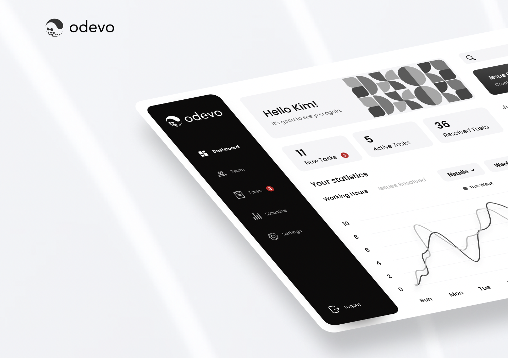

# Odevo Issue Management App

Technical property anagement necessitates an easy-to-use, connected, and reliable way to report and manage property issues for residents, facility caretakers, and managers alike. Our management app connects all users in one streamlined and easy-to-use platform.

### Screenshot

## Case Study

- Figma Link - [Odevo Issue Management App](https://www.figma.com/file/qK8ILsTrWV9Bn1YXacLPmU/Odevo-Issue-Reporting-%26-Management-App?node-id=141%3A23414)

## Development server

This project was generated with [Angular CLI](https://github.com/angular/angular-cli) version 13.3.6.

Run `ng serve` for a dev server. Navigate to `http://localhost:4200/`. The application will automatically reload if you change any of the source files.

## Build

Run `ng build` to build the project. The build artifacts will be stored in the `dist/` directory.

## Running unit tests

Run `ng test` to execute the unit tests via [Karma](https://karma-runner.github.io).

## Running end-to-end tests

Run `ng e2e` to execute the end-to-end tests via a platform of your choice. To use this command, you need to first add a package that implements end-to-end testing capabilities.

## Author

- LinkedIn - [@FredrikRidderfalk](https://www.linkedin.com/in/fredrikridderfalk/)
- Website - [My Personal Portfolio](https://fredrikridderfalk.github.io/)
- GitHub - [@FredrikRidderfalk](https://github.com/FredrikRidderfalk)
- Dribbble - [@Ridderfalk](https://dribbble.com/Ridderfalk)
- Twitter - [@Ridderfalk](https://twitter.com/Ridderfalk)
